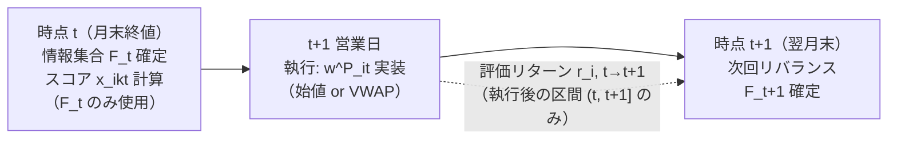
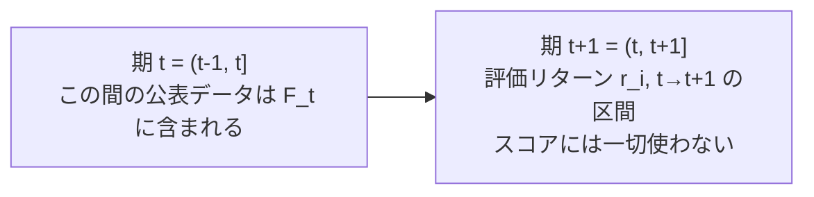

# 第0章: 記法とタイミング規約

## 0.1 基本記法

- 銘柄: $i = 1, \dots, N_t$（$N_t$ は時点 $t$ のユニバース銘柄数。**時変**であることに注意）
- リバランス時点: $t = 1, \dots, T$（月次リバランスなら月末営業日等、明示的に定義する）
  - **時間規約**: $t$ は「点」（当該営業日の終値時点のスナップショット）。期間として読む場合は $(t-1, t]$ を「期 $t$」とし、その期末状態が時点 $t$ の値。$\mathcal{F}_t$ には $(t-1, t]$ 中に公表されたデータも含まれる（公表日 $\le t$ なら利用可）。リターン $r_{i,t \to t+1}$ は区間 $(t, t+1]$ のものであり、スコアの情報区間と重ならない。
- ファクター: $k = 1, \dots, K$
- $r_{i,t \to t+1}$: 銘柄 $i$ の $t$ から $t+1$ の実現リターン
- $x_{i,k,t}$: 時点 $t$ における銘柄 $i$ のファクター $k$ エクスポージャー
- $w^P_{i,t}$: ポートフォリオウェイト、$w^B_{i,t}$: ベンチマークウェイト
- $w^A_{i,t} = w^P_{i,t} - w^B_{i,t}$: アクティブウェイト

## 0.2 情報集合と大原則

時点 $t$ の意思決定に使えるのは、**$t$ 時点までに市場参加者が実際に入手可能だった情報**のみ:

$$\mathcal{F}_t = \{ \text{時点 } t \text{ までに公表・観測済みの全データ} \}$$

大原則:

$$w^P_{i,t} = f(\mathcal{F}_t) \quad \text{かつ} \quad \text{評価対象リターンは } r_{i,t \to t+1}$$

つまり「**スコアは $t$ 以前の情報のみ、リターンは $t$ より後のみ**」。この境界線がすべて。

## 0.3 データ種別ごとの利用可能時点

### (a) 価格・出来高データ
- 時点 $t$ のスコア計算には **$t$ 時点の終値まで**利用可。
- ただし実務では「$t$ 終値でスコア計算 → $t$ 終値で執行」は不可能（計算時間ゼロを仮定している）。保守的には:
  - スコア計算: $t$ の終値まで
  - 執行価格: **$t+1$ の始値（または終値、VWAP）**
- リターン計測も執行タイミングに合わせる: $r_{i,t \to t+1}$ を「$t+1$ 始値 → $t+2$ 始値」等で定義するか、「$t$ 終値 → $t+1$ 終値」で近似するかを**最初に固定し全編で統一**する。

### (b) 財務データ（決算）
最もルックアヘッドが混入しやすい領域。

- **決算期末日（fiscal period end）ではなく発表日（announcement date）ベース**で利用可否を判定する。
- 理想: 発表日付きのPoint-in-Timeデータベースを使用。
  $$x_{i,k,t} = g(\text{最新の「発表済み」財務諸表}), \quad \text{発表日} \le t$$
- 発表日が取得できない場合の保守的ラグ:
  - 日本株: 決算期末から**45〜60日ラグ**（決算短信の提出実務に対応）
  - 新興国（インド等）: 提出期限が長い・遅延も多いため**90日ラグ**が無難
- **遡及修正（restatement）** にも注意: 修正後の数値は修正発表日以降のみ利用可。PITデータベースでない場合、バックテストは「修正後の綺麗な数値」で行われがち。

### (c) コンセンサス予想（アナリスト予想）
- 予想の**集計日（as-of date）** が $t$ 以前であること。
- リビジョン系ファクターは「$t$ 時点のスナップショット vs 過去のスナップショット」の差分で構成する。ベンダーの「確定値バックフィル」に注意。

### (d) インデックス構成・ベンチマークウェイト
- $w^B_{i,t}$ は **$t$ 時点で公表済みの構成**を使う。
- リバランス「発表日」と「実施日」の区別: 発表日以降なら将来の構成変更を戦略に使ってよい（それは公開情報）。実施日前に実施後ウェイトをベンチマークとして使うのは不可。

### (e) マクロ・外生変数
- 経済統計は**発表日ベース**（例: 7月CPIは8月中旬発表 → 8月中旬以降のみ利用可）。
- **速報値 vs 改定値**: バックテストでは改定後系列が配信されがち。リアルタイムで観測されたのは速報値。可能ならリアルタイム・ヴィンテージデータを使用。

### (f) ユニバース定義そのもの
- サバイバーシップバイアス: 時点 $t$ のユニバースは「**$t$ 時点で上場・組入基準を満たしていた銘柄**」。現在の構成銘柄で過去を遡ると上場廃止銘柄が消え、リターンが上方バイアス。
- 上場廃止銘柄のリターン処理（デリスティングリターン）も明示する。

## 0.4 タイムラインの標準形

月次リバランスの標準タイムライン:

補足: 情報区間とリターン区間の対応

## 0.5 チェックリスト（各ファクター設計時に自問）

1. この変数の**公表日**はいつか？ 期末日と混同していないか？
2. ベンダーデータは**バックフィル・遡及修正**されていないか？
3. スコア計算に $t$ 終値を使うなら、執行は $t+1$ 以降になっているか？
4. ユニバース・ベンチマークは $t$ 時点の姿か？
5. 標準化（z-score等）の平均・分散は**クロスセクション**か？ 時系列なら $t$ までのデータのみで計算しているか？（expanding/rolling、全期間統計は不可）

---

*次章: 第1章 ユニバースとリターン定義*
