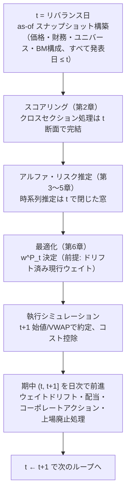
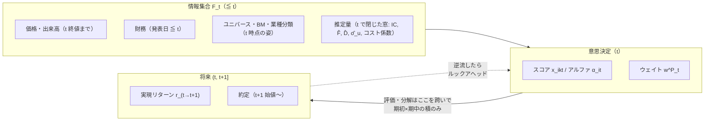

# 第8章: バックテスト設計（PIT規律・実装・容量）

ここまでの各章のPIT規律を、実装可能な**バックテストの設計原則**として統合する。

## 8.1 イベントループの設計（PIT規律の実装形）

バックテストの正しい構造は「**時点 $t$ に立って、$\mathcal{F}_t$ だけで意思決定を再現する**」イベントループ:

### アンチパターン: 行列一括計算

pandasで「全期間 × 全銘柄」のパネルを先に作り、列方向の一括演算で処理する実装は高速だが、以下が混入しやすい:

| アンチパターン | 混入するルックアヘッド |
|---|---|
| 全期間でz-score（`df.groupby('stock').transform(zscore)`） | 時系列標準化に将来の平均・分散（第2章2.4） |
| 全期間の残差から一括で `std()` | スペシフィックリスクに将来残差（第3章3.5） |
| 現在のユニバース・業種分類でパネルを構築 | サバイバーシップ・分類の遡及（第1・2章） |
| `ffill()` の無制限適用 | 上場廃止後もデータが延命、失効した財務データの利用（第2章2.2） |

一括計算を使うなら、**各演算が「$t$ 断面で閉じているか」を演算単位で監査**する。イベントループは遅いが監査が構造的に容易 — 研究の初期はループで正とし、高速化した一括実装をループ実装と突合検証するのが安全な開発順序。

## 8.2 データのヴィンテージ管理

| データ | 管理方法 |
|---|---|
| 財務 | 発表日付きPITデータベース。なければ保守的ラグ（第0章0.3(b)） |
| ユニバース・BM構成 | 月次スナップショットを履歴保存（再現不能な「現在時点からの遡及」を避ける） |
| 業種分類 | 分類の変更履歴を保持 |
| マクロ | リアルタイム・ヴィンテージ（速報値）系列 |
| 商用リスクモデル | 当時配信値のアーカイブ（第5章5.5） |
| 自社シグナル | **本番稼働後は毎期のスコア・ウェイト・約定を保存**（将来のバックテストが「当時の実物」と突合できる = 最強のPIT検証） |

## 8.3 執行の現実性

- **約定価格**: $t$ 終値でスコア → $t+1$ 始値/VWAP約定（第0章0.4）。終値約定を仮定するなら「終値でスコアが計算できる」時間的余裕の正当化が必要
- **取引可能性フィルタ**: ストップ高/安（インドならサーキットフィルター・価格バンド）、取引停止、外国人保有規制（FPI上限）で**注文が執行できない日**をモデル化。執行不能なら翌日以降に持ち越すか諦めるかの規約を決める
- **部分約定**: 参加率上限（例: ADVの5〜10%）を超える注文は複数日に分割。分割中の価格変動リスクがコストに乗る
- コストモデル（第6章6.3）を通した**ネットリターンでの評価**が本線。グロスは診断用

## 8.4 容量分析（キャパシティ）

戦略が吸収できる運用資産の目安。AUMを増やすと:

$$\text{ネットアルファ}(\text{AUM}) = \text{グロスアルファ} - \underbrace{\text{コスト}(\text{AUM})}_{\text{インパクト項は } \propto \sqrt{\text{AUM}}}$$

- 第6章6.3の平方根則より、1回のリバランスコストの単価は $\sqrt{|Q|/\text{ADV}} \propto \sqrt{\text{AUM}}$ で増加。**ネットアルファがゼロになるAUMが理論容量**
- 実効的には (i) 保有制限（発行済株式や浮動株の数%上限）、(ii) 参加率上限による執行日数の伸びとシグナルディケイ（第4章4.1）の競合、が先に効くことが多い
- 小型株ティルトの強い戦略ほど容量が小さい。**分位分析が等ウェイトで有効に見える戦略（第7章7.1）は容量の観点でも要注意** — 同じ根から出る問題

## 8.5 ロバストネスチェック

| チェック | 内容 |
|---|---|
| サブ期間分割 | 前半/後半、レジーム別（危機期を含む/除く）で符号と大きさが保存されるか |
| パラメータ摂動 | 半減期・分位数・制約閾値・リバランス日を±変化させて結果が滑らかに変わるか（崖があれば過学習の兆候） |
| リバランス日ずらし | 月末→月中など実行日をずらしても成立するか（月末効果への過適合の検出） |
| ユニバース摂動 | 流動性フィルタの閾値を動かす、上位/下位の時価総額帯を除外 |
| コスト感応度 | コスト係数を2倍にしてもネットで正か |
| 多重検定調整 | 試行数を記録し、デフレートSR等で「最良の1本」の見かけの有意性を割り引く |

## 8.6 シリーズ総括: PIT規律の一枚図

全章のタイミング規律は、結局この一枚に集約される:

### 各章の規律の対応表（索引）

| 規律 | 章 |
|---|---|
| 発表日ベースの財務データ、保守的ラグ | 0.3(b), 2.1 |
| サバイバーシップ・バックフィル・デリスティング | 1.1, 1.3 |
| クロスセクション統計は $t$ 断面、時系列統計は $t$ で閉じた窓 | 2.3–2.4, 3.5, 5.2 |
| 動的ウェイト・IC・ファクター選択は $t$ までの実績のみ | 2.6, 3.4, 4.2 |
| 研究モード（全期間・事後）と運用モード（PIT）の区別 | 3.4, 5.4, 7章 |
| ハイパーパラメータを結果で選ばない | 6.6, 8.5 |
| 期初ウェイト/エクスポージャー × 期中リターン | 1.4, 3.2, 7.1, 7.3 |
| 執行タイミングとスコア計算の分離 | 0.4, 8.3 |

---

*前章: 第7章 評価 — 本シリーズ完*
