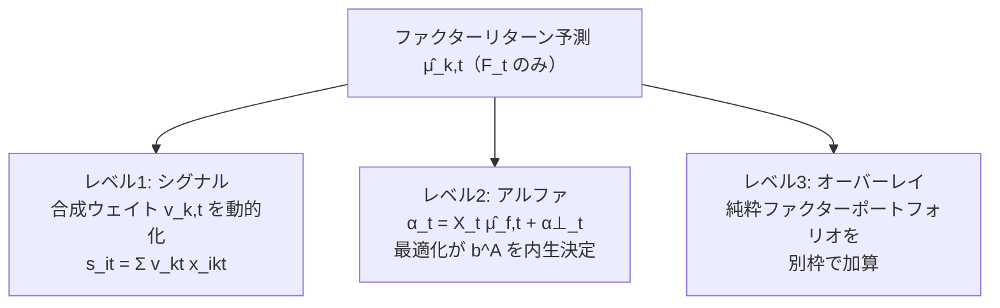

# A.1 枠組みと実装レベル

## A.1.1 問題の定式化

基礎シリーズではファクタープレミアムを暗黙に定数として扱った（第3章のFama-MacBeth: $E[f_k] = \bar{f}_k$ を検定）。ファクタータイミングはこれを**条件付き期待値**に置き換える:

$$E_t[f_{k,t \to t+1}] = \mu_k(\mathbf{s}_{k,t}), \qquad \mathbf{s}_{k,t} \in \mathcal{F}_t$$

- $\mathbf{s}_{k,t}$: 予測変数（コンディショニング変数）。ファクター自身の過去リターン（モメンタム、A.2）、バリュエーション・スプレッド、ボラ・相関構造（A.3）など
- 無条件プレミアム $E[f_k] > 0$ の獲得（静的ファクター投資）と、条件付き変動 $\mu_k(\mathbf{s}_{k,t}) - E[f_k]$ の獲得（タイミング）は**別のアルファ源**であり、成功の難易度も大きく異なる（A.6の懐疑論）

タイミングの成果の分解（1ファクターの場合の直観）:

$$E\big[ v_{k,t} \, f_{k,t \to t+1} \big] = \underbrace{E[v_{k,t}] \, E[f_{k,t \to t+1}]}_{\text{静的プレミアム} \times \text{平均配分}} + \underbrace{\text{cov}(v_{k,t},\ f_{k,t \to t+1})}_{\text{タイミング付加価値}}$$

**タイミングの付加価値は配分とファクターリターンの共分散**に集約される。この共分散が正であることを、コスト控除後・多重検定調整後に示せるか、が実証のすべて。

## A.1.2 3つの実装レベル

同じ $\hat{\mu}_{k,t}$ をどこに注入するかで、実装は3レベルに分かれる。

### レベル1: シグナルレベル（合成ウェイトの動的化）

第2章2.6の $s_{i,t} = \sum_k v_{k,t} \, x_{i,k,t}$ で $v_{k,t} = g(\hat{\mu}_{k,t})$ とする。

- 長所: 既存パイプラインへの追加変更が最小。ポートフォリオ構築（第6章）はそのまま
- 短所: **制御対象が間接的**。$v_{k,t}$ を動かすと再標準化・非線形処理を経て銘柄順位が変わるが、最終的なアクティブ・ファクターエクスポージャー $b^A_{k,t}$ がいくらになるかは制約・最適化次第。「バリューを2倍にした」つもりが $b^A$ は1.3倍、ということが普通に起きる
- 短所: タイミング判断と銘柄選択の損益が混ざり、事後の帰属分析（第7章）でタイミング単独の成否を切り出しにくい

### レベル2: アルファレベル（期待ファクターリターンの明示投入）

$$\boldsymbol{\alpha}_t = X_t \, \hat{\boldsymbol{\mu}}_{f,t} + \boldsymbol{\alpha}^{\perp}_t$$

第4章4.3の「直交化するか残すか」の選択肢のうち「意図的に残す」を体系化した形。最適化（第6章6.2）が $\hat{\boldsymbol{\mu}}_{f,t}$ とファクターリスク $\hat{F}_t$ のトレードオフを解き、**$\mathbf{b}^A_t$ を内生的に決める**。

- 長所: 理論的に最もクリーン。タイミングの強さがリスク（$\hat{F}_t$）・制約と同じ土俵で自動調整される。ファクターエクスポージャー制限（$|b^A_k| \le \bar{b}_k$）が暴走の安全弁として機能
- 短所: $\hat{\mu}_{f,t}$ の推定ノイズが最適化に直撃する（エラー・マキシマイゼーションのファクター版）。縮小・上限の設計（A.4）が実質的な生命線
- タイミングの意図が「ファクターティルトの制御」である以上、**本来の制御変数は $b^A_{k,t}$** であり、このレベルが正攻法

### レベル3: オーバーレイレベル（純粋ファクターポートフォリオの加算)

$$\mathbf{w}^A_t = \mathbf{w}^{A,\text{core}}_t + \sum_k \theta_{k,t} \, \boldsymbol{\omega}^{(k)}_t$$

$\boldsymbol{\omega}^{(k)}_t$ は第3章3.3の純粋ファクターポートフォリオ（ファクター $k$ に単位エクスポージャー、他はゼロ）、$\theta_{k,t} = h(\hat{\mu}_{k,t})$ が配分。

- 長所: **損益の帰属が構造的に明確**（オーバーレイの損益 $= \sum_k \theta_{k,t} f_{k,t\to t+1}$ がそのままタイミングの成績）。コアと独立に承認・停止でき、ガバナンス上扱いやすい。研究段階の「タイミングは本当に付加価値があるか」の検証器としても最適
- 短所: コアとオーバーレイの合算が最適とは限らない（コアの制約・コストと独立に動くため、合算後にロングオンリー制約違反・回転率超過が起き、事後の調整で意図が歪む）

### 使い分けの指針

| 状況 | 推奨レベル |
|---|---|
| タイミングの付加価値をまず検証したい（研究段階） | 3（単独評価が容易） |
| 本番でティルトを規律的に制御したい | 2（$b^A$ を直接制御、リスクと同じ土俵） |
| パイプライン変更コストを最小にしたい・タイミングは弱く効かせる程度 | 1（ただし $b^A$ の実現値を事後監視） |

## A.1.3 もう一つの軸: ローテーション vs スケーリング

$\sum_k |v_{k,t}| = 1$ 型の規準化の下では、動かせるのは**ファクター間の相対配分（ローテーション）**のみ。これと独立な自由度として**ファクターリスク総量のスケーリング**がある:

$$\mathbf{b}^A_t = c_t \cdot \tilde{\mathbf{b}}^A_t, \qquad c_t = \text{リスク総量の調整係数}, \quad \tilde{\mathbf{b}}^A_t = \text{相対配分}$$

- ローテーション: 「今はバリューよりモメンタム」という判断。予測変数はファクター**別**の $\mathbf{s}_{k,t}$
- スケーリング: 「今はファクターベット全体を落とす」という判断。予測変数はファクター**共通**の状態変数（ボラ、相関、クラウディング指標）。ボラティリティ・マネジメント（実現ボラの逆数でエクスポージャーをスケール）はこちらの代表例
- 実証文献の結論も2軸で異なる（スケーリング系は比較的頑健、ローテーション系は論争的 — A.2以降）ため、**設計・評価とも分けて扱う**

## A.1.4 PIT規律（基礎シリーズとの接続）

- $\hat{\mu}_{k,t}$ の推定（回帰係数・ランキング閾値等）は $t$ までの $\{\hat{f}_{k,s}\}_{s \le t}$ とその時点の予測変数のみ（第2章2.6・第3章3.4の規律そのまま）
- 予測変数自体のPIT: バリュエーション・スプレッドは時点 $t$ のクロスセクションで完結するが、「スプレッドが歴史的に見て広いか」の判定に**全期間の分位を使うと典型的ルックアヘッド**（expanding分位のみ可）
- タイミングは静的戦略より**構造的に回転率が高い**。第6章6.3のコスト込み・第8章のロバストネスチェック（特にパラメータ摂動とサブ期間分割）の適用が静的戦略以上に重要

## A.1.5 主要文献（本節の枠組みに対応するもの）

| 文献 | 掲載 | 位置づけ |
|---|---|---|
| Asness, "The Siren Song of Factor Timing" (2016) | JPM (Special Issue) | タイミング懐疑論の代表。静的分散への追加価値のハードルの高さを整理。A.6で詳述 |
| Asness, Chandra, Ilmanen & Israel, "Contrarian Factor Timing is Deceptively Difficult" (2017) | JPM | バリュエーションベースのタイミングが実質バリューファクターの二重取りになるという批判 |
| Arnott, Beck & Kalesnik, "To Win with 'Smart Beta' Ask If the Price Is Right" (2016) | Research Affiliates | 対抗側: ファクターのバリュエーションがその後のリターンを予測するという主張。上と対で読む |
| Haddad, Kozak & Santosh, "Factor Timing" (2020) | RFS | PCA主成分レベルでのタイミング可能性を体系検証。理論的に最も厳密な枠組みの一つ |
| Gupta & Kelly, "Factor Momentum Everywhere" (2019) | JPM | ファクターモメンタムの包括実証（65ファクター）。A.2の中心文献 |
| Ehsani & Linnainmaa, "Factor Momentum and the Momentum Factor" (2022) | **JF** | ファクターモメンタムが個別株モメンタムを包含するという主張。A.2で詳述 |
| Moreira & Muir, "Volatility-Managed Portfolios" (2017) | **JF** | スケーリング軸の代表。実現ボラ逆数スケーリングがシャープ改善という実証 |
| Cohen, Polk & Vuolteenaho, "The Value Spread" (2003) | **JF** | バリュエーション・スプレッドによる期待リターン予測の古典。A.3の基礎 |

（JF = Journal of Finance, RFS = Review of Financial Studies, JPM = Journal of Portfolio Management。JPMは実務系の代表誌でこの分野の主戦場だが、査読の厳格さはJF/RFSと同列でない点は割り引いて読む）

---

*次節: A.2 ファクターモメンタム — 定義・形成期間・Lo-MacKinlay分解による源泉診断*
