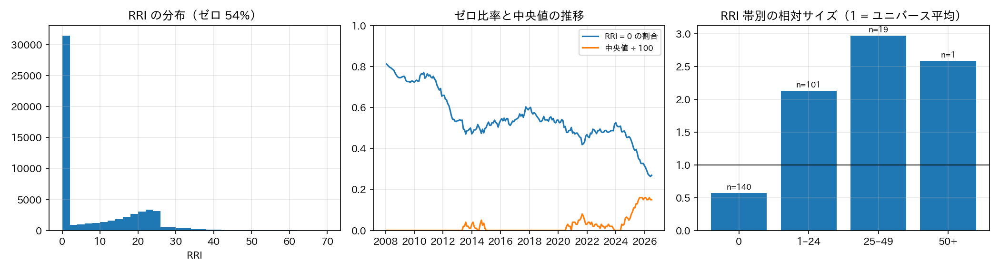
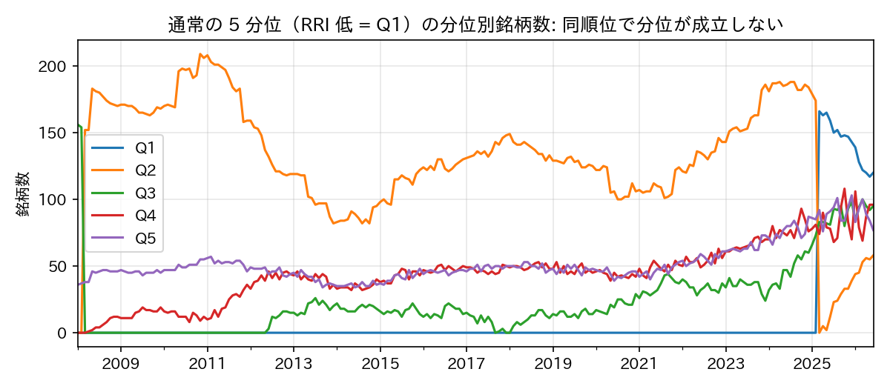
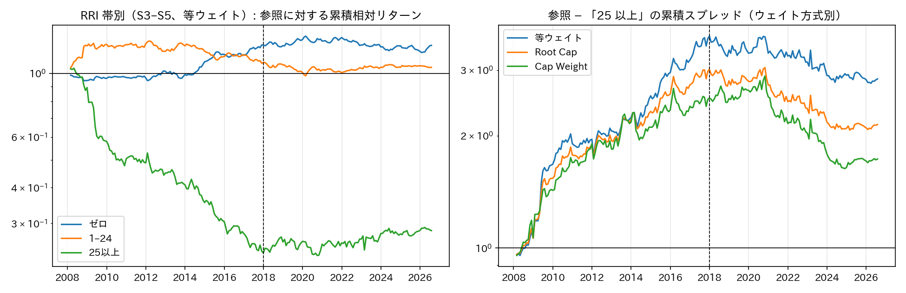
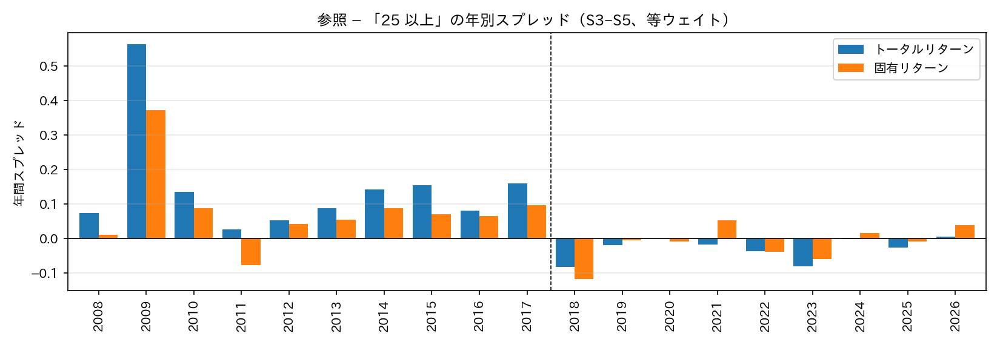
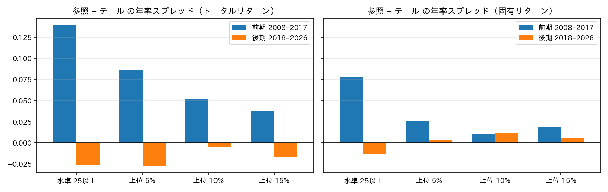
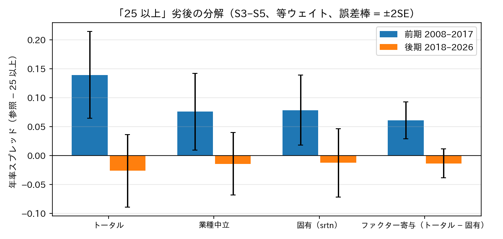
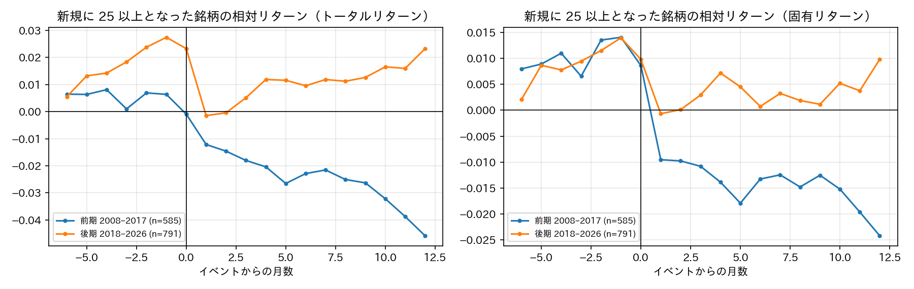
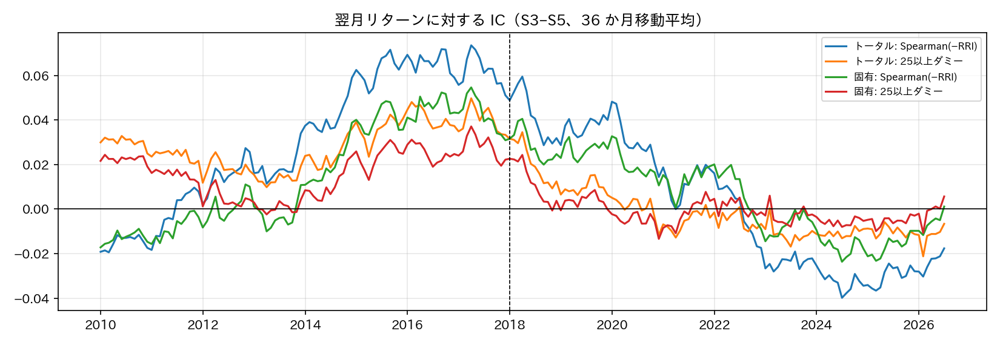
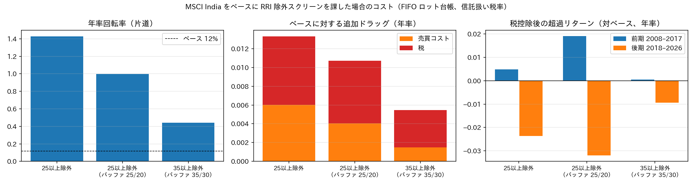
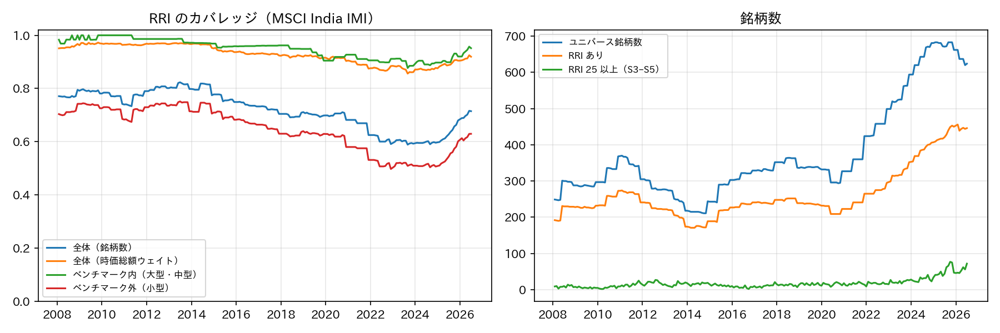

# インド株式市場における RepRisk Index（RRI）のシグナル採用可否

対象: MSCI India IMI（ユニバース）/ MSCI India（ベンチマーク）、月次リバランスのロングオンリー戦略
データ: `input/msci_india_imi/alpha/reprisk/repr_current_rri`（2007-01〜2026-07）、リターンは BARRA GEMLT の `rtn`（トータル）と `srtn`（固有）
検証期間: 2008-01〜2026-06（222 か月）。前期 = 2008–2017、後期 = 2018–2026
図の再生成: `uv run python experiments/reprisk/docs/make_figures.py`（数値は `fig/numbers.json`）

---

## 0. 結論

**RRI をリターン予測シグナルとして採用しない。** 根拠は次の 4 点。

1. **効果は消失している。** 2008–2017 年に存在した「RRI 25 以上の劣後」（参照対比 年率 13.9%、R/R 1.18）は、2018 年以降は年率 −2.7%（R/R −0.29）。後期 103 か月の 95% 信頼区間の上限は +3.5% で、前期の効果は統計的に棄却される（前後期の差 z = 3.4）。
2. **消失は検証設計では説明できない。** テールの定義（水準 / 順位）、ウェイト方式、サイズ制御、業種中立、ファクター除去（固有リターン）、水準ではなく変化（イベント）のいずれで見ても後期の効果はゼロ。特定の切り口の問題ではなく、情報そのものが失われている。
3. **順位シグナルとして成立しない構造。** 観測の 54% がゼロ、情報は「25 以上」の二値にのみ存在し、テール内に用量反応はない。サイズと相関 0.4。仮に効果が残っていても用途は除外フラグに限られる。
4. **除外スクリーンとしてもコストが見合わない。** MSCI India に「25 以上を除外」を課すと年率回転率が 12% から 143% に上がり、売買コストと税で年率 1.3% の追加ドラッグ、TE 2.3% が生じる。税控除後の対ベース超過は全期間 −0.9%、2018 年以降 −2.4%。

---

## 1. 検証設計

| 項目 | 設定 |
| --- | --- |
| セグメント | サイズ 5 分位（ユニバースウェイトの対数順位）の S3〜S5（中型・大型）。小型はカバレッジ 65% でスコアなし・ゼロが 84% を占めるため主分析から除外 |
| グループ | RRI 帯: ゼロ / 1–24 / 25 以上（RepRisk の「中」以上）。順位テール: 上位 5 / 10 / 15% |
| ウェイト | 等ウェイト（主）、Root Cap、Cap Weight（1 銘柄 10% 上限） |
| 参照 | 同セグメント・同方式で組んだスコアあり銘柄のポートフォリオ。グループとの差でサイズ効果を除く |
| 主指標 | 「参照 − 25 以上」の年率スプレッド、R/R、勝率。翌月リターンに対する IC |
| 方向 | RRI は低いほど良いと仮定（高 = レピュテーションリスク大） |

---

## 2. 論拠

### 2.1 RRI は順位シグナルとして成立しない

- 観測の 54% がゼロ、実際の値域は 0〜69。非ゼロも 1–24 に集中し、50 以上は月あたり 1 銘柄未満。
- ゼロ比率は 2008 年の 78% から 2026 年の 28% へ低下。**水準は時点間で比較できない**（RepRisk のカバレッジ拡張）。
- 帯別の相対サイズ（1 = ユニバース平均）はゼロ 0.57、1–24 が 2.1、25–49 が 3.0。S3〜S5 内でもサイズとの Spearman 相関 0.40。報道量が企業規模に比例する構造的な交絡。

- 通常の 5 分位はゼロ銘柄が同順位のため成立しない（Q1 平均 10 銘柄、Q2 に 131 銘柄が集中）。分析は帯（水準）ベースで行う必要がある。
- 25 以上の内側を順位で 2 分割・3 分割してもスプレッドは R/R ≈ 0（Appendix B.3）。**情報は「25 以上かどうか」の二値にしかない。**

### 2.2 水準効果は 2008–2017 年に存在し、2018 年以降消失した

| 参照 − 25 以上（S3〜S5、等ウェイト） | 前期 2008–2017 | 後期 2018–2026 |
| --- | --- | --- |
| トータルリターン 年率 / R/R / 勝率 | +13.9% / 1.18 / 63% | −2.7% / −0.29 / 47% |
| 固有リターン 年率 / R/R / 勝率 | +7.8% / 0.82 / 59% | −1.3% / −0.15 / 48% |
| 年別スプレッドが正の年数 | 10 / 10 | 3 / 9（いずれも +0.5% 未満） |

- ゼロ群と 1–24 群の参照対比はそれぞれ +2.5% / +0.6%（前期）、+0.1% / −0.5%（後期）で、効果はほぼすべて「25 以上」の劣後から来ている（Appendix B.2）。
- 後期の推定値 −2.7% ± 3.1%（SE）は、前期の +13.9% を 95% 信頼区間で棄却する。**「後期は期間が短く検出できないだけ」という説明は成り立たない**（§3.1）。

### 2.3 消失は検証設計では説明できない

**(a) テールの定義**: カバレッジ拡張で「25 以上」の銘柄数が 9 → 60 超に増えたため、順位（上位 x%）でテールを定義し直しても、後期は効果がない。前期でも順位定義は水準定義より弱く、固有リターンでは上位 10% が +1.1% に留まる。閾値のドリフトは消失の原因ではなく、水準に固有の情報があった。

**(b) ウェイト方式**: 後期の「参照 − 25 以上」は等ウェイト −2.7%、Root Cap −3.6%、Cap Weight −3.9%。方式によらず負（Appendix B.1）。

**(c) 業種・ファクター**: 前期の劣後 13.9% のうち業種中立で 7.6%、固有リターンで 7.8%（R/R 0.82）が残る。前期は業種ティルト（エネルギー・素材・公益）が約半分、銘柄固有が約半分で、固有部分は独立に有意だった。後期は業種中立 −1.5%、固有 −1.3% と、どの成分もゼロ。

**(d) 構成の変化**: 25 以上の業種構成（エネルギー 2.4〜2.7 倍、公益 1.6 倍）とサイズ構成（S5 が約 70%）は前後期でほぼ同じ。構成の変化でも説明できない。

### 2.4 変化（イベント）にも情報がない

水準が織り込まれていても、事案発生直後（新規に 25 以上となった月）の反応は残りうる。1,618 件のイベントで確認した。

| 新規 25 以上（固有リターン、参照対比） | 前期 | 後期 |
| --- | --- | --- |
| イベント月（h = 0） | −0.6% | −0.4% |
| 事後 12 か月累積 | −2.4%（t −2.0） | +1.0%（t 0.9） |
| 事後 1 か月保有ポートフォリオ 年率 / IR | −11.9% / −0.85 | +2.7% / +0.22 |

- 事案発生月の同時反応は両期間に存在するが、月末のスコアで観測するため取引できない。
- 前期に存在した事後ドリフトは後期に消失。**市場の織り込みが同月内で完了するようになった**と解釈するのが自然。
- 大幅上昇（Δ ≥ 10）や変化量の IC にも、どちらの期間でも情報がない（|t| < 1.6、Appendix B.5）。

### 2.5 IC

| 翌月リターンに対する IC（S3〜S5） | 前期 mean / t 値 | 後期 mean / t 値 |
| --- | --- | --- |
| 25 以上ダミー（トータル） | 0.028 / 3.6 | −0.008 / −0.9 |
| 25 以上ダミー（固有） | 0.016 / 2.3 | −0.002 / −0.2 |
| Spearman −RRI（トータル） | 0.029 / 2.8 | −0.007 / −0.6 |
| Spearman −RRI（固有） | 0.015 / 1.5 | 0.003 / 0.3 |

前期は 25 以上ダミーが最も安定（ICIR 0.33、勝率 63%）。後期はすべての定義で符号が消え、36 か月移動平均は 2018 年前後を境にゼロ近傍。

---

## 3. 想定される反論と応答

**3.1 「後期は 8.5 年で短く、検出力が足りない」**
後期の年率スプレッドは −2.7%、SE 3.1%。前期の +13.9%（SE 3.8%）との差は z = 3.4 で、前期並みの効果が後期に存在する仮説は棄却される。「効果がゼロである」ことは証明できないが、「前期並みに存在する」ことは否定できる。採用判断に必要なのは後者。

**3.2 「除外スクリーン（二値）としてなら使えるのでは」**
効果が二値にしかないことには同意する。ただし §4 のとおり、除外は年率 1.3% の追加ドラッグと 2.3% の TE を伴い、税控除後の超過は負。リスク管理・ESG 方針としての除外は別の意思決定だが、その場合もコストを年率 1% 超と見込む必要がある。

**3.3 「サイズや業種の交絡を落としきれていないのでは」**
主分析は S3〜S5 に限定し参照を同方式で組んでいる。さらに業種中立、ベンチマーク内限定、サイズ層化、固有リターン（GEMLT の全ファクターを除去）で確認し、いずれも前期は有意・後期はゼロ。交絡の除き方を変えても結論は動かない。

**3.4 「閾値 25 はカバレッジ拡張で意味が変わったのでは」**
その仮説は順位定義（上位 5 / 10 / 15%）で直接検証し、後期に効果がないことを確認した（§2.3a）。

**3.5 「事案直後の短期反応を日次で取れば有効では」**
月次データでは検証できない。イベント月の同時反応（−0.4〜−0.6%）は残っているので、日次の RepRisk データと日次リターンがあれば別途検証の価値はある。ただし対象は月次リバランスの戦略であり、本判断には影響しない。

**3.6 「前期の効果は本物だったのか」**
前期は固有リターンで R/R 0.82、IC の t 値 2.3〜3.6、年別 10 年中 10 年が正。データマイニングの産物とは考えにくい。「かつて有効で、織り込まれて消えた」ファクターの典型的な経路であり、再び有効になる根拠は現時点で示せない。

---

## 4. 除外スクリーンとして用いる場合の回転率・税コスト

インドでは売却ごとにキャピタルゲイン課税が発生するため、閾値近傍の出入りはそのまま税ドラッグになる。MSCI India（時価総額ウェイト）をベースに「RRI 25 以上を保有しない」ルールを課した場合を、`docs/india_tcg.md` §4 の FIFO ロット台帳（STCG / LTCG、年度内通算、繰越）で評価した。税率は信託扱い（現行 STCG 23.92% / LTCG 14.95%）、売買コストは買い 15bp・売り 25bp、初期構築後 12 か月はバーンインとして除外。

| MSCI India ベース（全期間） | ベース | 25 以上除外 | 25 以上除外（バッファ 25/20） | 35 以上除外（35/30） |
| --- | --- | --- | --- | --- |
| 除外ウェイト（時価総額比） | — | 17.6% | 37.8% | 4.7% |
| 年率回転率（片道） | 12% | 143% | 100% | 44% |
| 追加ドラッグ（売買コスト + 税） | — | 0.60% + 0.73% = **1.33%** | 0.40% + 0.67% = 1.07% | 0.15% + 0.40% = 0.55% |
| 短期比率（実現益に占める STCG） | 1% | 44% | 34% | 8% |
| TE（対ベース） | — | 2.3% | 3.8% | 0.9% |
| 税控除後の超過（対ベース、全期間 / 後期） | — | −0.9% / −2.4% | −0.6% / −3.2% | −0.4% / −0.9% |

- 25 以上は超大型に偏るため、除外銘柄は平均 14 でも時価総額では 17.6% を落とす。回転率は 12% → 143%、追加ドラッグは年率 1.3%。グロスの超過（全期間 +0.3%）を打ち消し、税控除後は −0.9%。2018 年以降は効果消失と LTCG 課税復活が重なり −2.4%。
- 実現益の 44% が短期。閾値の出入りで 12 か月未満の売却が多い。ベースは含み益を繰り延べる（期末の清算時税額が価値の 7%）が、スクリーン版は途中で実現して納税済み（0.3%）で、繰延効果も失う。
- 回転率を抑えるためのバッファ（20 未満で復帰）は、20〜25 を行き来する大型株を除外したままにするため除外ウェイトが 38%、TE 3.8% に膨らむ。**除外スクリーンにはバッファより閾値の引き上げが有効**で、35 以上なら追加ドラッグ 0.55%、TE 0.9% に収まる。
- IMI ベースでも同じ構図（25 以上除外の税控除後超過 −0.7%、後期 −2.0%。Appendix B.7）。

---

## 5. 判断

- **リターン予測シグナルとしては採用しない。** マルチファクターモデルのスコアにも組み込まない。
- **再検討の条件**: (i) 2018 年以降のサンプルで「参照 − 25 以上」が固有リターンで有意に正（例: 直近 5 年で R/R > 0.5）となった場合、(ii) 日次データで事案直後の反応を取引可能な形で確認できた場合。
- **除外スクリーンとして用いる場合**（ESG 方針上の要請など）は、リターン寄与を期待せず、年率 1% 超のドラッグと TE 2% 超を織り込む。設計は閾値を高く置く（35 以上）方がバッファより効率的で、除外による売却はロット単位で 12 か月超まで待つ判断（`docs/india_tcg.md` §2.5）と組み合わせて短期比率を下げる。

---

## Appendix A. データと定義

**A.1 カバレッジ**

| | 平均カバレッジ（銘柄数） | 最小 |
| --- | --- | --- |
| 全体 | 72%（時価総額ウェイトでは 93%） | — |
| ベンチマーク内（大型・中型） | 95% | 88% |
| ベンチマーク外（小型） | 65% | 50% |

2021〜2024 年に IMI の銘柄数が急増した局面でカバレッジが 60% 前後まで低下。2007 年はユニバースが 50 銘柄程度のため検証から除外。

**A.2 定義**

- サイズ分位: 各月、ユニバースウェイト $w_{i,t}$（浮動株調整後時価総額に比例）の対数順位で 5 分位。S3〜S5 が主分析対象
- グループリターン: $r^{(g)}_{t+1} = \sum_i w^{(g)}_{i,t} r_{i,t+1}$。等ウェイトは $1/n$、Root Cap は $\sqrt{M_i}$ 比例、Cap Weight は $M_i$ 比例で 1 銘柄 10% 上限（超過分を比例再配分）
- 参照: 同セグメント・同方式のスコアあり銘柄ポートフォリオ。「参照 − 25 以上」が正 = 25 以上を避けることが有利
- 回転率: 片道 $\tfrac12\sum_i |w_{i,t} - w^-_{i,t}|$（ドリフト調整済み）
- 業種中立: $\sum_i w_i (r_i - r_{\text{sector}(i)})$、$r_{\text{sector}}$ は同セグメント・同業種（GICS 先頭 2 桁）のスコアあり銘柄の等ウェイト
- 固有リターン: GEMLT の `srtn`（全ファクター寄与を除いた残差）。等ウェイト平均は月 +0.8% と正に偏るが、参照との差では相殺される
- IC: 翌月リターンとのクロスセクション相関（Spearman、またはダミーとの Pearson）。符号は「正 = RRI 低が良い」に揃える
- SE（年率）: 月次スプレッドの標準偏差 × √12 ÷ √年数。信頼区間は ±1.96 SE

**A.3 実装**: `src/alphaeval`（`quantile_analysis` / `weight_portfolio` / `portfolio_returns` / `information_coefficient` / `tax.simulate_after_tax` 等）。検証ノートブックは `experiments/reprisk/01`〜`09`。

## Appendix B. 追加の表

**B.1 ウェイト方式別「参照 − 25 以上」（S3〜S5）**

| 方式 | リターン | 前期 年率 / R/R | 後期 年率 / R/R |
| --- | --- | --- | --- |
| 等ウェイト | トータル | +13.9% / 1.18 | −2.7% / −0.29 |
| 等ウェイト | 固有 | +7.8% / 0.82 | −1.3% / −0.15 |
| Root Cap | トータル | +11.8% / 1.07 | −3.6% / −0.41 |
| Root Cap | 固有 | +7.1% / 0.76 | −1.7% / −0.21 |
| Cap Weight | トータル | +10.2% / 0.79 | −3.9% / −0.39 |
| Cap Weight | 固有 | +6.3% / 0.58 | −2.5% / −0.28 |

**B.2 RRI 帯別の参照対比超過（S3〜S5、等ウェイト、トータル）**

| 帯 | 平均銘柄数 | 年率回転率 | 前期 年率 / R/R | 後期 年率 / R/R |
| --- | --- | --- | --- | --- |
| ゼロ | 83 | 119% | +2.5% / 0.69 | +0.1% / 0.04 |
| 1–24 | 77 | 186% | +0.6% / 0.12 | −0.5% / −0.19 |
| 25 以上 | 17 | 625% | −13.9% / −1.18 | +2.7% / 0.29 |

**B.3 25 以上の内訳（S3〜S5、参照 = 25 以上全体、`05_tail_weighting`）**

| 分割 | 平均銘柄数 | スプレッド（低 − 高）年率 / R/R |
| --- | --- | --- |
| 水準 25–34 / 35 以上 | 13 / 4 | +4.1% / 0.16（35 以上は 70% の月で 5 銘柄未満） |
| 順位 2 分割 | 9 / 9 | −0.8% / −0.04 |
| 順位 3 分割（T1 − T3） | 6 / 6 | +1.3% / 0.05 |

**B.4 テール定義別（S3〜S5、等ウェイト）**

| 定義 | 前期 トータル / 固有 | 後期 トータル / 固有 |
| --- | --- | --- |
| 水準 25 以上 | +13.9% / +7.8% | −2.7% / −1.3% |
| 上位 5% | +8.7% / +2.6% | −2.7% / +0.3% |
| 上位 10% | +5.2% / +1.1% | −0.5% / +1.2% |
| 上位 15% | +3.8% / +1.9% | −1.6% / +0.6% |

**B.5 変化・イベント（`08_change_events`）**

- イベント件数: 新規 25 以上 1,618、大幅上昇（Δ1 ≥ 10）1,166、25 未満へ離脱 1,613。2023 年以降急増（2025 年は新規 25 以上が 241 件）
- 大幅上昇の事後 1 か月保有: 前期 −2.1%（IR −0.13）、後期 −0.8%（IR −0.05）
- −Δ1 / −Δ3 の Spearman IC: 全定義で |t| < 1.6。後期は負
- イベント前 6 か月の相対リターンは正（+0.9〜2.3%）。株価上昇の後に注目度が上がる方向の関係

**B.6 年別スプレッド（参照 − 25 以上、等ウェイト、トータル / 固有）**

| 年 | トータル | 固有 | 年 | トータル | 固有 |
| --- | --- | --- | --- | --- | --- |
| 2008 | +7% | +1% | 2018 | −8% | −12% |
| 2009 | +56% | +37% | 2019 | −2% | −1% |
| 2010 | +14% | +9% | 2020 | 0% | −1% |
| 2011 | +3% | −8% | 2021 | −2% | +5% |
| 2012 | +5% | +4% | 2022 | −4% | −4% |
| 2013 | +9% | +6% | 2023 | −8% | −6% |
| 2014 | +14% | +9% | 2024 | 0% | +2% |
| 2015 | +15% | +7% | 2025 | −3% | −1% |
| 2016 | +8% | +6% | 2026（6 月まで） | 0% | +4% |
| 2017 | +16% | +10% | | | |

**B.7 除外スクリーンのコスト（MSCI India IMI ベース、全期間 / 後期）**

| スクリーン | 除外ウェイト | 年率回転率 | 追加ドラッグ | TE | 税控除後超過（全期間 / 後期） |
| --- | --- | --- | --- | --- | --- |
| 25 以上除外 | 15.0% | 121% | 1.21% | 1.9% | −0.7% / −2.0% |
| 25 以上除外（バッファ 25/20） | 32.6% | 83% | 0.97% | 3.1% | −0.4% / −2.8% |
| 35 以上除外（35/30） | 4.0% | 40% | 0.51% | 0.8% | −0.3% / −0.8% |

ベース（IMI 時価総額ウェイト）の年率回転率 12%、税ドラッグ 0.38%。前期（〜2017）は LTCG 非課税だったため税ドラッグは小さく（0.4〜0.5%）、グロスの効果（+1.5〜2.5%）で税控除後も正だった。詳細は `09_exclusion_cost`。

## Appendix C. 図とノートブックの対応

| 図 | 内容 | ノートブック |
| --- | --- | --- |
| fig01 | カバレッジ | `01_coverage` |
| fig02 | 分布・ゼロ比率・帯別サイズ | `02_distribution`, `03_size` |
| fig09 | 5 分位の同順位問題 | `04_quantile` |
| fig03, fig04 | 3 群の累積相対リターン、方式別・年別スプレッド | `04_quantile`, `05_tail_weighting` |
| fig05 | テール定義（水準 vs 順位） | `06_regime`, `07_regime_srtn` |
| fig06 | 業種中立・固有・ファクター分解 | `06_regime`, `07_regime_srtn` |
| fig07 | イベントスタディ | `08_change_events` |
| fig08 | IC の推移 | `06_regime`, `07_regime_srtn` |
| fig10 | 除外スクリーンの回転率・税コスト | `09_exclusion_cost` |
